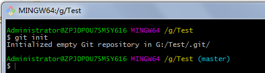

# Git速成笔记
---

本文的参考链接：http://stormzhang.com/github/2016/06/04/learn-github-from-zero4/

---
- Git是Linux之父Linus开发的新一代版本控制系统
- 什么情况下需要使用Git？

        1、防止代码丢失
        2、几个人做同一个项目，分模块开发，可以同步别人的代码
            3、可以进行版本回滚
                4、可以记录版本更改记录
                
## 使用Git创建本地库，并进行版本控制操作

1、在本地创建一个文件夹，右键调出Git bash Here 

一般git安装后要进行用户名和邮箱配置（我配置的是github账号）

> git config --global user.name "coderfang"

> git config --global user.email "2659980901@qq.com"

2、初始化本地库
> git init 

>git status 

git status 查看那状态，此命令行会经常用到
可以看到有一个追踪到的文件没有被提交

3、向本地库添加修改后的文件
> git add test.txt(此处为文件名)

> git status 

添加完后查看状态，提示改动的文件需要被提交到库里

4、向本地库提交修改
> git commit -m '此处是描述信息'

此时已经完成了在本地库的一系列操作

5、查看日志信息
> git log

打印出提交记录

6、分支的使用

- 显示分支
>git branch 
- 创建分支a
>git branch a

>git branch

查看一下会发现多了分支a，但此时当前所在分支仍然是master（master前面有*，一般项目默认主分支为master）
- 切换分支a
>git checkout a

>git branch

查看一下会发现，此时位于分支a上，这个时候就可以在分支a上进行上边的修改添加提交等操作了
-完成操作后，要合并分支
注意：此时需要切换到master分支，然后再执行git merge！

>git merge 

## 向Github提交项目

1、配置ssh

在git bash here 中输入
>ssh

如果显示

则已经安装了ssh，否则自行搜索安装吧！
接着
>ssh-keygen -t rsa

以下直接Copy的
>指定 rsa 算法生成密钥，接着连续三个回车键（不需要输入密码），然后就会生成两个文件 id_rsa 和 id_rsa.pub ，而 id_rsa 是密钥，id_rsa.pub 就是公钥。这两文件默认分别在如下目录里生成：
Linux/Mac 系统 在 ~/.ssh 下，win系统在 /c/Documents and Settings/username/.ssh 下，都是隐藏文件，相信你们有办法查看的。
接下来要做的是把 id_rsa.pub 的内容添加到 GitHub 上，这样你本地的 id_rsa 密钥跟 GitHub 上的 id_rsa.pub 公钥进行配对，授权成功才可以提交代码。

最后要在github上配置ssh，自行搜索吧

最最后测试是否配置成功
>ssh -T git@github.com

2、提交项目

有两中方案：

1.github上有项目，你clone到本地，然后对其修改后再更改

2.本地有项目，在github上新建一个库，把这两个库连接起来

这里给出第二种方案的解决办法：
在本地库目录下调出git命令行窗口
>git remote add origin git@github.com:coderfang/test.git

意思是：添加一个远程仓库，地址是：git@github.com:coderfang/test.git，origin是给远程仓库取名字，名字可以自取。

最后，将本地仓库的项目推送到远程仓库去
>git push origin master 

