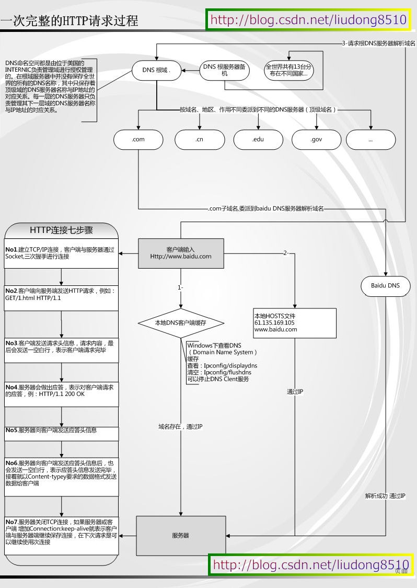

#一次完整的Http请求
---
###有图有真相!上图！（网上大神给出来的[http 请求图](http://blog.csdn.net/liudong8510/article/details/7908093)）

####简诉

1、在浏览器地址栏输入地址，通过DNS解析得到IP地址（DNS解析看后面）

	接下来进行http连接7个步骤（中间一些步骤组合在一起了）

2、通过ip地址，服务器与客户端进行TCP/IP连接，通过socket进行三次握手

3、客户端向服务器端发送请求头，请求内容，最后发送一空白行，表示发送完毕

4、服务器端接受到请求头信息后，要发送一个应答头信息给客户端，最后发送一空白行，表示发送完毕

5、接着服务器端一Content-Type要求的数据格式发送数据给客户端

6、服务器关闭TCP连接，如果服务器或客户端增加Connection：keep-alive就表示客户端与服务器会保留此次连接，在下次请求可以继续使用此次连接

###关于DNS解析[参考连接](http://www.linux178.com/web/httprequest.html)

####简诉

1、首先查看浏览器自身DNS缓存是否对应的缓存

2、次之，查看操作系统自身的DNS缓存是否有对应的缓存

3、次之，尝试读取hosts文件（位于C:\Windows\System32\drivers\etc）

4、次之，浏览器会发起一个DNS系统调用，去访问本地配置的首选DNS服务器，发起域名解析（这个过程有点像递归，找不到的话就一层一层下去询问）

5、操作系统就会查找NetBIOS name Cache（NetBIOS名称缓存，就存在客户端电脑中的），那这个缓存有什么东西呢？凡是最近一段时间内和我成功通讯的计算机的计算机名和Ip地址，就都会存在这个缓存里面。什么情况下该步能解析成功呢？就是该名称正好是几分钟前和我成功通信过，那么这一步就可以成功解析。

6、次之，查询WINS服务器

7、次之，进行广播查找

8、次之，读取LMHOSTS文件

---
笔记为方便记录，只是大致描述我学习了解到的知识。