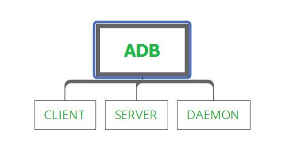
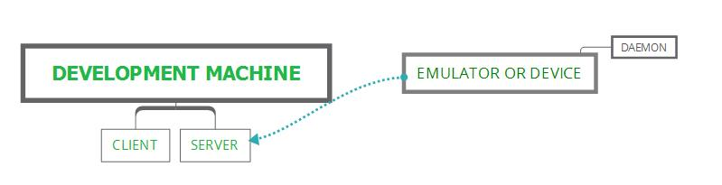
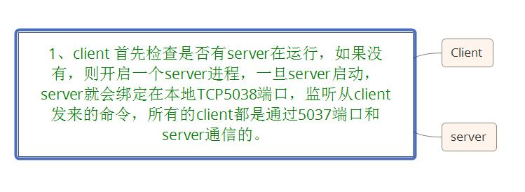
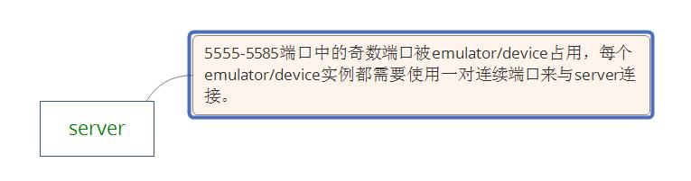

## 关于adb你需要了解的基本知识
作者：Jinx  
时间：2016-8-17

前言：
>Android Debug Bridge 简称 adb，这是一款多功能命令行工具，能与你的模拟器或者安卓设备进行通信。

###本文分为3部分：
- adb是什么？
- 
- adb是如何组成的？
-
- adb是如何工作的？
- 

### 第一部分：adb是什么？

  就如前言所说的，adb是Android Debug Bridge 的简称，Android Debug Bridge 即Android Debug桥，它相当为你的开发工具和你的模拟设备或真实设备提供通信的桥梁。它是一个典型的client-server 程序。

### 第二部分：adb是如何组成的？

简单来看，如图：

 如上图所示adb 由三个部分组成，client，server，daemon，就如介绍的顺序一样，server是作为一个中介，管理着client和daemon之间的通信。

那么，client，server，daemon分别什么？它们又有什么功能呢？

#### 1、client
它是运行在development machine中(大概就是开发工具，例如Android Studio，DBMS 之类的)，能够发送命令行跟daemon进行通信。

#### 2、daemon
它是作为一个后台进程，运行在每一个模拟器或真实设备上。可以在设备上运行命令行

#### 3、server
它是作为一个后台进程，运行在development machine中。管理着client和daemon之间的通信。

上图：

### 第三部分：adb是如何工作的？

如图：（图中TCP 5038端口是错的，应该是TCP 5037端口，作图的时候写错了，也懒得再画）

一对连续的端口，例如下面：

>Emulator 1, console: 5554
>
Emulator 1, adb: 5555
>
Emulator 2, console: 5556
>
Emulator 2, adb: 5557
>
and so on...

下面是官方的server介绍：

>As shown, the emulator instance connected to adb on port 5555 is the same as the instance whose console listens on port 5554.
Once the server has set up connections to all emulator instances, you can use adb commands to access those instances. Because the server manages connections to emulator/device instances and handles commands from multiple adb clients, you can control any emulator/device instance from any client (or from a script).

[参考链接](https://developer.android.com/studio/command-line/adb.html)(需要翻墙)

---
现在只是大致描述adb的基本概念，这是我学习过程做的笔记，有哪些不准确的地方，可以直接issu我~后续还有关于adb命令行语法，使用等，以后有细看再详细写一下。